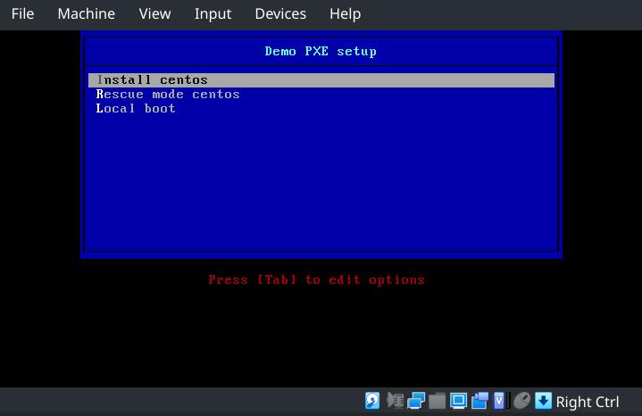
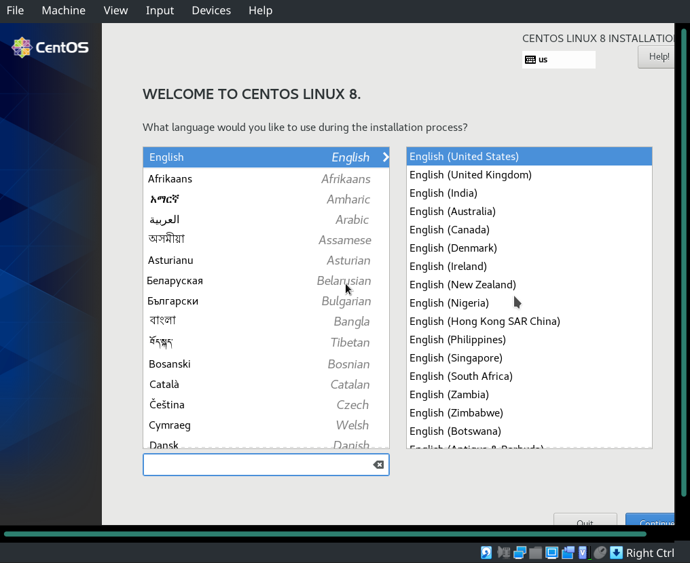

## Решение задания

Необходимо заранее скачать iso образ, который будет подключен к ВМ как источник для установки по сети:

```
curl -O http://mirror.yandex.ru/centos/8.3.2011/isos/x86_64/CentOS-8.3.2011-x86_64-boot.iso
```

Далее нужно запустить ВМ `pxe_server`:

```
vagrant up pxe_server
```

К этой ВМ будет подключен iso образ, настроена загрузка только с HDD.

Вся настройка сервера выполняется с помощью Ansible:

```
ansible-playbook playbook.yml
```

Playbook выполняет: 

- установку необходимых пакетов
- запускает службы `nginx`, `tftp`, `firewalld`
- настраивает firewall для работы веб и ftp сервера
- конфигурирует dhcp сервер
- создает репозиторий для установочных дистрибутивов
- монтирует в репозиторий iso образ установочного дистрибутива
- настраивает pxelinux

После успешного запуска playbook'а можно проверить работоспособность pxe-сервера, запустив ВМ `pxe_client`:

```
vagrant up pxe_server
```

Для ВМ настроена загрузка только по сети. 
При запуске `Vagrant` будет пытаться подключиться к ВМ через ssh, но не сможет этого сделать, так как система будет загружаться по сети. При этом в консоли будут выводится сообщения, которые можно игнорировать:

```
...
pxe_client: Warning: Connection refused. Retrying...
...
```

Запуск `pxe_client` откроет окно VirtualBox для выбора вариантов загрузки:



Выбрав первый пункт - система начнёт установку дистрибутива:



При выборе второго пункта система загрузится в режиме восстановления.
Третий пункт загрузит систему с имеющегося HDD.