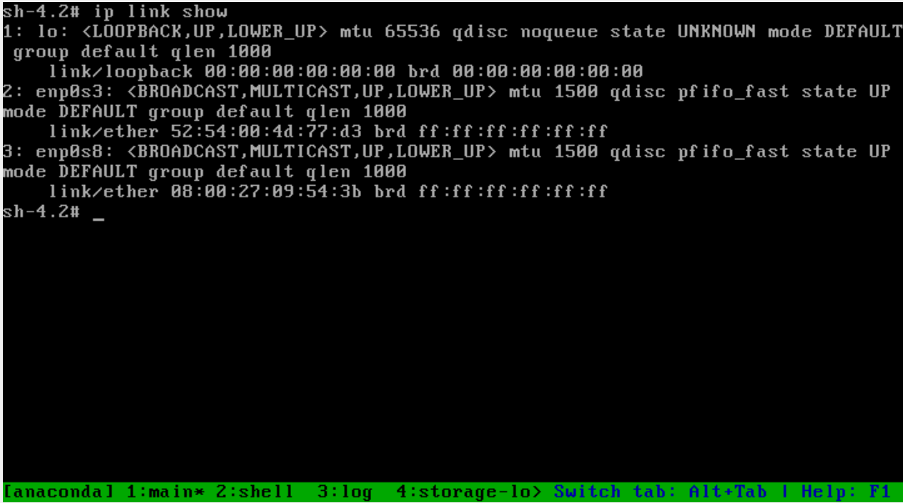
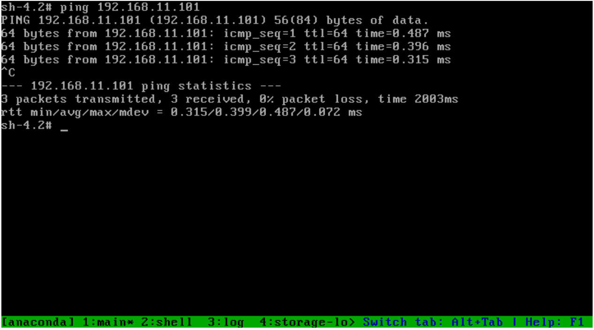
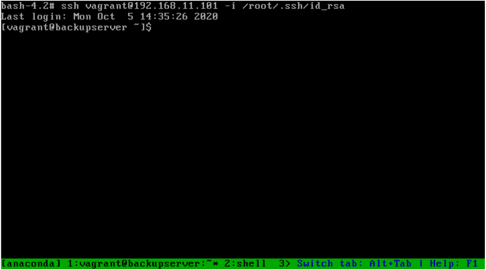
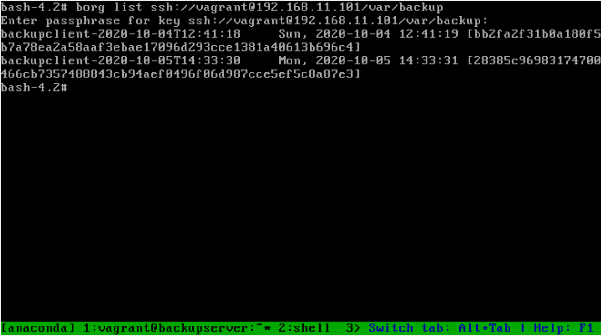
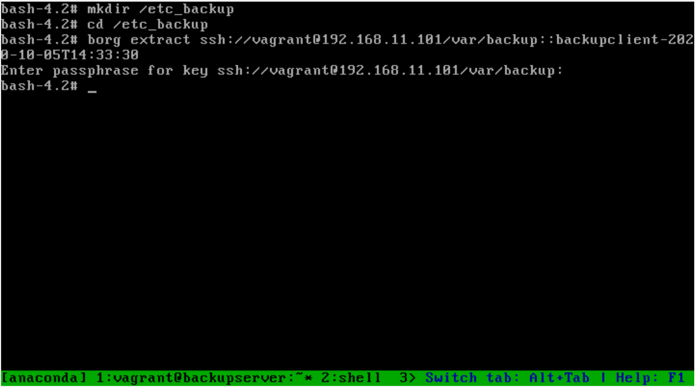

## Решение задания

Для проверки задания нужно запустить ВМ `backup_server`, которая будет центральным сервером для хранения резервных копий:

```
vagrant up backup_server
```

При запуске ВМ с помощью shell provisions будут выполнены:

- Подготовка диска `sdb` для хранения бекапов. На диске будет создана файловая система `xfs`, а диск смонтирован в каталог `/var/backup`.
- Установлен mount-unit для автоматического монтирования диска [var-backup.mount](./var-backup.mount).
- Установлен пакет `borgbackup` из репозитория `epel-release`.

Центральный сервер для хранения логов на ВМ `backup_server` готов.

Далее нужно запустить ВМ `backup_client`:

```
vagrant up backup_client
```

При запуске ВМ с помощью shell provisions будут выполнены:

- Скопирован закрытый ssh ключ с помощью которого можно подключиться к ВМ `backup_server`.
- Установлен пакет `borgbackup` из репозитория `epel-release`.
- Инициализирован репозиторий для хранения архивов на ВМ `backup_server`.
- Установлен скрипт [borg_backup.sh](./borg_backup.sh) для автоматического создания резервных копий.
- Установлен timer-unit для автоматического запуска скрипта бекапа: [borg-backup.service](./borg-backup.service) [borg-backup.timer](./borg-backup.timer)

После запуска ВМ `backup_client` автоматически начнут создаваться резервные копии каталога `/etc` каждые 5 минут.

Логи процесса созданий резервных копий можно посмотреть в журнале systemd:

```
journalctl -u borg-backup.service
...
Oct 04 12:25:07 backupclient borg_backup.sh[4085]: A /etc/selinux/targeted/active/modules/100/mip6d/lang_ext
Oct 04 12:25:07 backupclient borg_backup.sh[4085]: A /etc/selinux/targeted/active/modules/100/modemmanager/cil
Oct 04 12:25:07 backupclient borg_backup.sh[4085]: A /etc/selinux/targeted/active/modules/100/modemmanager/hll
Oct 04 12:25:11 backupclient borg_backup.sh[4085]: Sun Oct  4 12:25:11 UTC 2020 Backup and Prune finished successfully
```

Список архивов в репозитории можно получить с помощью команды:

```
borg list ssh://vagrant@192.168.11.101/var/backup
Enter passphrase for key ssh://vagrant@192.168.11.101/var/backup:
backupclient-2020-10-04T12:30:06     Sun, 2020-10-04 12:30:07 [e9cfa999b96ccc92a7ec4c473904832fee40cfd4e090ef2f68400a8c6ddd102e]
```

Проверим работоспособность архивов на примере восстановления каталога `/etc`.

Удалим все содержимое каталога на сервере `backup_client`:

```
rm -rf /etc
```

После удаления каталога система будет не работоспособной (или со временем станет такой).
Для восстановления нужно загрузить ВМ с подключенным носителем дистрибутива centos-7.
При загрузке с носителя дистрибутива выбрать пункт `Troubleshooting` - `Rescue a CentOS system`.

В режиме восстановления нужно выбрать пункт `Skip to shell`. Все остальные действия будут выполняться в консоли.

В первую очередь нужно настроить сетевой интерфейс для подключения к серверу хранения резервных копий:

```
# Выведем доступные сетевые интерфейсы.
ip link show
```



```
# Добавим ip адрес на интерфейс enp0s8.
ip addr add 192.168.11.102/24 dev enp0s8

# Проверим доступность сервера хранения резервных копий.
ping 192.168.11.101
```



Далее смонтируем диск (разделы) с поврежденной операционной системой:

```
mount -t xfs /dev/sda1 /mnt/sysimage
```

Так же нужно смонтировать каталог `/dev` в `/mnt/sysimage/dev` - это необходимо для работы `ssh` (требует устройство /dev/null):

```
mount --bind /dev /mnt/sysimage/dev
```

Выполним chroot в каталог /mnt/sysimage:

```
chroot /mnt/sysimage
```

Для подключения через ssh нужно создать пользователя с uuid = 0 и выполнить тестовое подключение к серверу хранения резервных копий (используя уже существующий ssh-ключ):

```
useradd vagrant -u 0
ssh vagrant@192.168.11.101 -i /root/.ssh/id_rsa
```



Чтобы команда `borg` использовала нужный ssh-ключ при подключении, нужно установить переменную окружения BORG_RSH:

```
export BORG_RSH='ssh -i /root/.ssh/id_rsa'
```

Теперь можно выполнять подключение к серверу хранения резервных копий:

```
borg list ssh://vagrant@192.168.11.101/var/backup
```



Восстановим последний архив в каталог /etc_backup:

```
mkdir /etc_backup
cd /etc_backup
borg extract ssh://vagrant@192.168.11.101/var/backup::backupclient-2020-10-05T14:33:30
```



Выйдем из chroot и переместим каталог /etc_backup/etc в /etc:

```
rm -rf /mnt/sysimage/etc 
mv /mnt/sysimage/etc_backup/etc /mnt/sysimage/
```

Перезагрузка.

Теперь можно загрузить систему с восстановленным каталогом `/etc`.