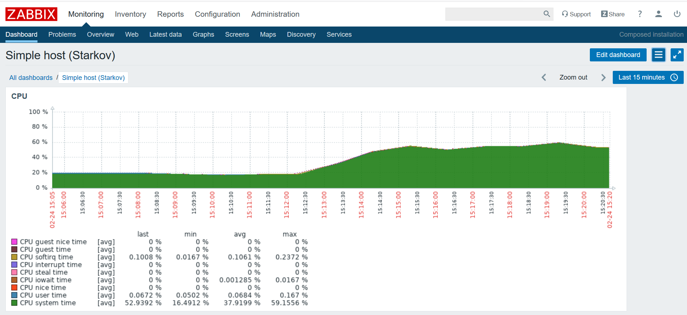

## Решение задания

Для проверки задания нужно запустить ВМ `zabbix`:

```
vagrant up zabbix
```

При запуске ВМ будет предложено установить плагин `vagrant-reload`, если он еще не установлен.
Это нужно сделать обязательно. 
Плагин нужен для того, чтобы перезагрузить ВМ между выполнением provisions.

Для ВМ `zabbix` уже будет запущен сам zabbix и его компоненты в docker контейнерах с помощью docker-compose.

Проверить работу zabbix можно подключившись к нему через браузер по адресу: `192.168.33.10` (логин: Admin, пароль: zabbix).
Возможно потребуется некоторое время на для полноценного запуска сервера и компонентов - обычно 10-20 секунд.

После того, как ВМ `zabbix` будет полностью готова нужно запустить ВМ `simple-host`:

```
vagrant up simple-host
```

Для этой ВМ будет установлен агент zabbix, с помощью скрипта `add_host_to_zabbix.py` хост автоматически добавится в систему zabbix, а скрипт `cpu_load.sh` станет ежеминутно создавать нагрузку на CPU.

Уже в GUI интерфейсе можно добавить свой dashboard:

