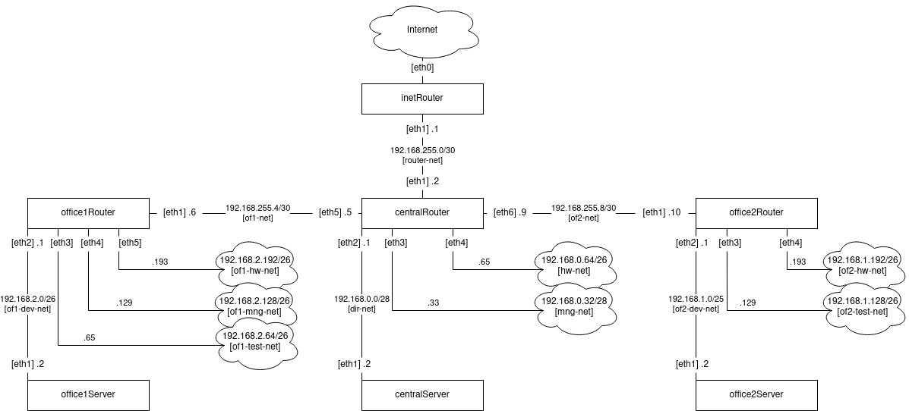

## Решение задания

### Схема сети


Список сетей:

|Network|Hosts|Broadcast|
|-------|-----|---------|
|192.168.255.0/30|2|192.168.255.3|
|192.168.255.4/30|2|192.168.255.7|
|192.168.255.8/30|2|192.168.255.11|
|192.168.0.0/28|14|192.168.0.15|
|192.168.0.32/28|14|192.168.0.47|
|192.168.0.64/26|62|192.168.0.127|
|192.168.1.0/25|126|192.168.1.127|
|192.168.1.128/26|62|192.168.1.191|
|192.168.1.192/26|62|192.168.1.255|
|192.168.2.0/26|62|192.168.1.63|
|192.168.2.64/26|62|192.168.1.127|
|192.168.2.128/26|62|192.168.1.191|
|192.168.2.192/26|62|192.168.1.255|

Свободные сети:

|Block|Network|
|-----|-------|
|192.168.0.0/24|192.168.0.16/28|
|192.168.0.0/24|192.168.0.48/28|
|192.168.0.0/24|192.168.0.128/28|
|192.168.255.0/24|192.168.255.12/30|
|192.168.255.0/24|192.168.255.16/28|
|192.168.255.0/24|192.168.255.32/27|
|192.168.255.0/24|192.168.255.64/26|
|192.168.255.0/24|192.168.255.128/25|

Для проверки задания нужно запустить ВМ:

```
vagrant up
```

После запуска всех ВМ нужно выполнить [ansible playbook](./network-playbook.yml), который настроит сеть:

```
ansible-playbook network-playbook.yml
```

Playbook выполняет следующие шаги:

- пересоздает соединения с учетом имени интерфейса.
- назначает ip адреса для соединений.
- удаляет маршрут по умолчанию с интерфейса eth0.
- устанавливает правильный адрес шлюза.
- добавляет маршруты.
- настраивает firewall.

Все команды в playbook идемпотентны, используют утилиты `nmcli` и `firewall-cmd`.

Для проверки сети нужно выполнить команду:

```
ansible all -a "traceroute -n -w 1 otus.ru"
```

В результатах выполнения команды, можно убедиться, что обеспечена сетевая доступность хостов и правильно настроена маршрутизация.